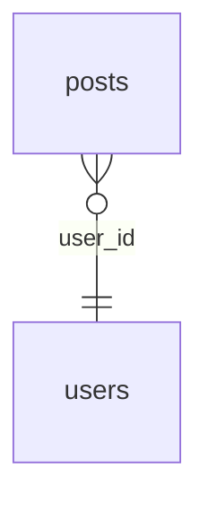

# Forge CLI — Database & Project Toolkit

Forge is a command‑line tool that helps you manage **database migrations**, **environment configuration**, and **project scaffolding** from a single, opinionated CLI.

It is built with Go and designed to be simple to integrate into your workflow, while staying powerful enough for real projects.

---

## Features

- **Database migrations**
  - Apply pending migrations in order (`forge db migrate`).
  - Roll back the last batch of migrations (`forge db rollback`).
  - Track applied migrations in the database using a dedicated `migrations` table.
  - Generate SQL migration files from stubs (`forge db make:sql <name>`).

- **Migration templates**
  - Generate `.sql` files from stub templates (e.g. `create_table_users`).
  - Built‑in stub support (e.g. `create_table`, `update_table`) with priority for user‑defined stubs in `database/stubs`.

- **Environment management**
  - Initialize `.env.forge` with Forge-specific variables (`forge init`).
  - Show the current Forge config file (`forge env`).

- **Project scaffolding**
  - Interactive wizard to create a new project:
    - Go project skeleton (`--lang go`)
    - Node.js project (`--lang node`)
    - TypeScript project (`--lang ts`)
    - Empty project (`--lang empty`)
    - From Git repository template (`--from <url>`)
  - Optional `--git-init` to initialize a git repo right after scaffolding.

- **Git integration**
  - Add git to an existing project and configure a remote:
    - `forge project git:add`
    - Supports `--dir` and `--remote` flags.
  - Creates an initial commit if there are no commits yet.

- **Upgrade**
  - `forge upgrade` downloads the latest release from GitHub and replaces the current binary (in‑place update).

- **Plugin support**
  - Load local project plugins from `.forge/plugins` and global plugins from `~/.forge/plugins`.
  - Create plugin scaffolds with `forge plugins create <vendor>/<name>`.
  - Build source-based Go plugins with `forge plugins build <vendor>/<name>`.
  - Install a local plugin globally with `forge plugins install <vendor>/<name>`.
  - Auto-build Go plugins declared with `"source": "src"` before execution.

---

## Installation

You can install Forge either **from a GitHub release (recommended)** or **from source**.

### 1. Install from GitHub Releases

Go to your repository releases page:

- `https://github.com/acolev/forge/releases/latest`

Pick the binary for your OS/architecture. With the default release naming pattern:

- `forge-darwin-arm64`   – macOS (Apple Silicon)
- `forge-darwin-amd64`   – macOS (Intel)
- `forge-linux-amd64`    – Linux x86_64

#### macOS (Apple Silicon, arm64)

```bash
curl -L https://github.com/acolev/forge/releases/latest/download/forge-darwin-arm64   -o /usr/local/bin/forge

chmod +x /usr/local/bin/forge
forge --help
```

#### macOS (Intel, amd64)

```bash
curl -L https://github.com/acolev/forge/releases/latest/download/forge-darwin-amd64   -o /usr/local/bin/forge

chmod +x /usr/local/bin/forge
forge --help
```

#### Linux (amd64)

```bash
curl -L https://github.com/acolev/forge/releases/latest/download/forge-linux-amd64   -o /usr/local/bin/forge

chmod +x /usr/local/bin/forge
forge --help
```

> If you prefer to avoid `sudo`/root, you can install Forge into a directory in your `$HOME`, such as `~/bin`, and add it to your `PATH`.

Example:

```bash
mkdir -p ~/bin
curl -L https://github.com/acolev/forge/releases/latest/download/forge-darwin-arm64   -o ~/bin/forge
chmod +x ~/bin/forge

echo 'export PATH="$HOME/bin:$PATH"' >> ~/.zshrc
source ~/.zshrc

forge --help
```

---

### 2. Install from source

```bash
git clone https://github.com/acolev/forge.git
cd forge

go mod tidy

go build -o forge ./cmd/main.go
# Move the binary to a directory in your PATH, for example:
mv forge /usr/local/bin/forge
```

---

## Updating Forge

### 1. Using upgrade (recommended)

Once Forge is installed, you can upgrade to the latest release with:

```bash
forge upgrade
```

This will:

1. Fetch the latest release from GitHub.
2. Download the binary asset matching your OS/architecture (e.g. `forge-darwin-arm64`).
3. Replace the current `forge` binary in place.

> If Forge is installed in a system directory (e.g. `/usr/local/bin`), you may need to run:
>
> ```bash
> sudo forge upgrade
> ```

### 2. Updating manually

You can also repeat the **install from GitHub Releases** steps with a newer version:

- Download the new binary.
- Replace your existing `forge` binary.
- Make sure it is executable.

---

## Usage

### Command structure

General pattern:

```bash
forge <group> <command> [flags]
```

Examples:

- `forge db migrate` (`--dry-run` to preview SQL)
- `forge db status`
- `forge db rollback` (`--step N` to roll back N batches)
- `forge db reset` / `forge db refresh` / `forge db fresh` (`--force` to skip confirmation)
- `forge db make:sql create_table_users`
- `forge db exec "SELECT * FROM users"` (`--file`, `--format json|csv`, or `-` for stdin)
- `forge db schema:show`
- `forge db schema:dump -o schema.sql`
- `forge db schema:erd -o erd.mmd` (`--format dot` for Graphviz)
- `forge seed make users`
- `forge seed make --from-table users` (generate a fixture from an existing table's schema)
- `forge seed up`
- `forge project create`
- `forge project git:add`
- `forge upgrade`
- `forge plugins create bookly/migrate`
- `forge plugins build bookly/migrate`
- `forge plugins install bookly/migrate`

---

## Schema introspection & diagrams

Forge can read the live database schema (sqlite / postgres / mysql) and render it
several ways. Forge's own bookkeeping tables (`migrations`, `seeds`) are hidden by
default — pass `--all` to include them.

```bash
forge db schema:show              # human-readable overview (tables, PK, FK, indexes)
forge db schema:dump -o db.sql    # SQL DDL dump
forge db schema:erd               # Mermaid erDiagram (renders on GitHub)
forge db schema:erd --format dot -o erd.dot   # Graphviz DOT
forge db schema:snapshot          # save schema to database/schema.snapshot.json
forge db schema:diff              # compare live DB against the snapshot
forge db schema:diff --exit-code  # non-zero exit if drifted (CI guard)
forge db make:model users -o models/user.go   # generate Go struct(s) from tables
```

`make:model` writes plain Go source into your project — Forge generates it, your
app compiles it (just like `make:sql` emits `.sql`). It is never loaded by Forge.

The Mermaid output can be pasted straight into a Markdown file:



---

## Environment management

### Initialize `.env.forge`

Create or update the `.env.forge` file for Forge-specific settings:

```bash
forge init
```

Typical responsibilities:

- Create `.env.forge` if it does not exist.
- Ensure Forge variables are present without colliding with application env.

Example:

```env
FORGE_DB_DSN=sqlite://database/database.db
FORGE_PLUGINS_DIR=.forge/plugins
```

### Show environment

Display the current Forge config file contents, or resolved defaults if the file does not exist:

```bash
forge env
```

---

## Plugins

Forge supports both local and global plugins:

- Local plugins live in `.forge/plugins`
- Global plugins live in `~/.forge/plugins`
- Local is the default for `create` and `build`

### Plugin scaffold

Create a local Go plugin:

```bash
forge plugins create bookly/migrate
```

This creates:

```text
.forge/plugins/bookly/migrate/plugin.json
.forge/plugins/bookly/migrate/src/go.mod
.forge/plugins/bookly/migrate/src/main.go
```

### Build a plugin

Build a local plugin:

```bash
forge plugins build bookly/migrate
```

Build a global plugin:

```bash
forge plugins build bookly/migrate --global
```

### Install globally

Install a local plugin into the global plugin directory:

```bash
forge plugins install bookly/migrate
```

### Source-based Go plugins

If a plugin manifest declares:

```json
{
  "lang": "go",
  "entry": "migrate",
  "source": "src"
}
```

Forge will build the platform-specific binary automatically before running the plugin.

### Available hooks

Current hooks exposed by Forge:

- `db.migrate.before`
- `db.migrate.after`
- `project.create.before`
- `project.create.after`

Example hook scaffold:

```bash
forge plugins create bookly/migrate --hook db.migrate.before
```

This creates a plugin manifest with:

```json
{
  "hooks": {
    "db.migrate.before": {
      "command": "db-migrate-before"
    }
  }
}
```

Notes:

- Hook payloads are not forwarded to plugins yet.
- For Go plugins, Forge auto-builds the binary before executing the hook.

---

## Database migrations

Forge manages migrations stored in `./database/migrations` and tracks them in a `migrations` database table.

### 1. Generate a migration

Create a new SQL migration file using a naming convention and optional stub:

```bash
forge db make:sql create_table_users
```

This will generate a file like:

```text
database/migrations/1763632453_create_table_users.sql
```

The file will have the following structure:

```sql
-- UP
-- your SQL goes here

-- DOWN
-- your rollback SQL goes here
```

If a stub exists for the prefix (for example `create_table.stub.sql` in `database/stubs`), Forge will use it and replace placeholders like `{table_name}`.  
User‑defined stubs in `database/stubs` have priority over built‑in ones.

### 2. Apply migrations

Run all pending migrations in ascending order:

```bash
forge db migrate
```

Forge will:

- Read all `.sql` files from `database/migrations`.
- Check which ones are not yet applied (via the `migrations` table).
- Execute the `-- UP` section of each pending migration.
- Store the migration file name and batch number in the `migrations` table.

### 3. Rollback last batch

Rollback the last batch of applied migrations:

```bash
forge db rollback
```

Forge will:

- Find the highest `batch` number in the `migrations` table.
- For all migrations in that batch:
  - Read the corresponding file.
  - Execute the `-- DOWN` section.
  - Remove migration records from the `migrations` table.

---

## Seeders

Forge stores YAML seed files in `./database/seeds`.

Available commands:

```bash
forge seed make users
forge seed up
forge seed run --only=users
forge seed status
forge seed reset
```

### Create a seed

Create a fixture seed scaffold:

```bash
forge seed make users
```

Create other types:

```bash
forge seed make roles --type sql
forge seed make bootstrap --type go
```

### Fixture seed format

Fixture seeds support either explicit `rows` or generated rows via `count + template`.

Example:

```yaml
name: users
type: fixture
table: users
count: 10
template:
  name: "fake:full_name"
  email: "fake:email"
  phone: "fake:phone"
  is_active: "fake:bool"
```

### Fake tokens

Built-in fake tokens:

- `fake:first_name`
- `fake:last_name`
- `fake:full_name`
- `fake:email`
- `fake:company`
- `fake:phone`
- `fake:sentence`
- `fake:uuid`
- `fake:bool`
- `fake:int:min:max`

Example:

```yaml
template:
  age: "fake:int:18:65"
  company: "fake:company"
```

### Apply seeders

Apply all pending seeders:

```bash
forge seed up
```

Apply only selected seeders:

```bash
forge seed run --only=users,roles
```

Show executed seeders:

```bash
forge seed status
```

Reset only seeder execution state:

```bash
forge seed reset
```

> Only migrations that have a valid `-- DOWN` section can be rolled back.

---

## Project scaffolding

Forge can bootstrap new projects via `forge project create`.

### Interactive wizard

```bash
forge project create
```

You will be guided through a wizard:

1. **Choose project type**:
   - Go project
   - Node.js project
   - TypeScript project
   - Empty project
   - From Git repository URL

2. **Project name**:
   - Default: derived from the Git URL or `forge-project`.

3. **Target directory**:
   - Default: `./<project-name>`.
   - If you enter `.`, Forge will use the current directory (no need for it to be empty, but use with care).

4. Optionally, if you created the project with `--git-init`, Forge will initialize a git repository inside the project.

### Non‑interactive usage

You can skip the wizard by passing flags:

#### Go project

```bash
forge project create --lang go --name my-api --dir ./services/my-api --git-init
```

#### Node.js project (JavaScript)

```bash
forge project create --lang node --name my-app
```

#### TypeScript project

```bash
forge project create --lang ts --name my-ts-app
```

#### Empty project

```bash
forge project create --lang empty --name sandbox
```

#### From Git template

```bash
forge project create --from https://github.com/user/template.git --name booking-api
```

In template mode Forge will:

- Clone the repository into a temporary directory.
- Remove the `.git` folder from the template.
- Copy files into your target directory.
- Optionally initialize a new git repository (`--git-init`).

---

## Git integration for existing projects

Command:

```bash
forge project git:add
```

### Interactive mode

Without flags, Forge will:

1. Use the current directory as the project root.
2. Initialize git if `.git` folder is missing.
3. Run `git add .`.
4. Create an initial commit if there are no commits yet.
5. Ask for a remote URL and add it as `origin`.
6. Ask if it should push the initial commit to `origin main`.

### With flags

```bash
forge project git:add --dir ./services/api --remote git@github.com:you/api.git
```

Flags:

- `--dir` — project directory (default: current directory).
- `--remote` — remote URL for `origin`. If omitted, Forge will ask interactively.

---

## Directory structure (typical)

- `cmd/`  
  Entry point for the CLI (main.go).

- `internal/migrations/`  
  Migration logic (create, run, rollback).

- `internal/project/`  
  Project scaffolding (`project create`, `project git:add`).

- `internal/plugins/`  
  Plugin loading and registration.

- `internal/selfupdate/`  
  Upgrade logic (`upgrade` command).

---

## Contributing

1. Fork the repository.
2. Create a new branch:

   ```bash
   git checkout -b feature/my-feature
   ```

3. Make your changes.
4. Run tests / build:

   ```bash
   go test ./...
   go build ./cmd/main.go
   ```

5. Commit and push:

   ```bash
   git commit -am "Add my feature"
   git push origin feature/my-feature
   ```

6. Open a Pull Request.

---

## License

This project is licensed under the **MIT License**.  
See the `LICENSE` file for details.
